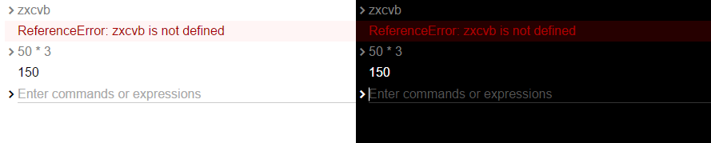

# Simple Console

Simple Console is nice clean command-line interface for the web.
[Check out the demo!](http://1j01.github.io/simple-console/)




## Features

* Light and [dark styles](#dark-mode)

* Easy rich HTML [output](#consolelogcontent)

* Command history accessible with up/down arrow keys, saved to `localStorage`

* Command history menu for mobile accessibility

* Doesn't create a duplicate history entry if you re-enter the last command

* Lets you delete history entries with <kbd>Shift+Delete</kbd>

* Includes [`aria`][] attributes
(although the accessibility could still use some work!)


## Usage

Download `simple-console.css` and `simple-console.js`,
and include in the `<head>`:
```html
<link rel="stylesheet" href="simple-console.css">
```
and anywhere before you use `SimpleConsole` but probably in the `<body>`:
```html
<script src="simple-console.js"></script>
```

### Example

```js
var con = new SimpleConsole({
	placeholder: "Enter JavaScript",
	handleCommand: function(command){
		try {
			con.log(eval(command));
		} catch(error) {
			con.error(error);
		}
	},
	autofocus: true, // if the console is to be the primary interface of the page
	storageID: "app-console"
});

// add the console to the page
document.body.appendChild(con.element);

// show any uncaught errors
con.handleUncaughtErrors();
```


### Page Setup

You should probably also include a `charset` and `viewport` like in the demo.

To make the console take up the entire page, use:
```css
html,
body {
	height: 100%;
	margin: 0;
	display: flex;
	flex: 1;
}
```

### Dark Mode

The dark styles take effect when the console element or any parent contains the class `dark`.

You could add a theme switcher like so:

```js
var toggleDarkMode = function() {
	if (console.element.classList.contains("dark")) {
		console.element.classList.remove("dark");
	} else {
		console.element.classList.add("dark");
	}
};
var button = console.addButton(toggleDarkMode);
button.textContent = "◐";
button.setAttribute("title", "Toggle dark theme");
button.setAttribute("aria-label", "Toggle dark theme");
```

### API

#### `new SimpleConsole(options)`

Creates a console instance.

**Note:** The `SimpleConsole` object is referred to as `console` below, but you should probably give it a different name so it doesn't conflict with the global console object.

`options.handleCommand(command)` is called when the user hits <kbd>Enter</kbd>.
You can handle the input however you want.
It's recommended that you catch errors and log them with `console.error`.
Other logging methods are documented below.

`options.outputOnly` specifies that there should be no input.
You must specify either `outputOnly` or `handleCommand`.

`options.placeholder` is strongly recommended especially with the default input styling as there is very little visual indication of the input (when it's not focused).

`options.autofocus` should be used within an application where the console is the primary interface.

`options.storageID` should be used to separate the command history of different consoles.
It's used as a [`localStorage`][] key prefix.

#### `console.element`

You must use this to add the console to the page,
e.g. `document.body.appendChild(console.element)`

#### `console.input`

The console's `<input>` element.
Can be used to add controls/widgets
i.e. `console.input.parentElement.appendChild(widget)`

#### `console.addButton(action)`

Adds a button to the right of the console's input area and returns the button element.

`action` should be a function.

#### `console.addPopupButton(updatePopup)`

Adds a button with a popup to the right of the console's input area and returns the button element.

`updatePopup(popupElement)` should update the contents of the popup.

Use `addPopupMenuButton` instead if the popup's contents are a standard menu.

#### `console.addPopupMenuButton(getItems)`

Adds a button with a standard popup menu to the right of the console's input area and returns the button element.

`getItems()` should return an array of items, with each item either of the form `{label, action}` or `{type: "divider"}`.

#### `console.handleUncaughtErrors()`

Sets up a [`window.onerror`][] event listener which logs any uncaught errors to the console.

#### `console.log(content)`

Logs the given text or element to the console.

#### `console.logHTML(html)`

Logs the given HTML to the console.

#### `console.error(content)`

Logs the given error message (or element) to the console.

#### `console.warn(content)`

Logs the given warning message (or element) to the console.

#### `console.info(content)`

Logs the given info message (or element) to the console.

#### `console.success(content)`

Logs the given success message (or element) to the console.

#### `console.getLastEntry()`

Returns the last logged entry as an `HTMLDivElement` for further manipulation.

#### `console.clear()`

Clears the console.


### TODO

* Support multiple arguments to `log`, `warn` etc.

* Distinguish error/success/warning messages for screen readers (maybe with `cue-before` from the CSS Speech Module)

* Solarized and retro themes

* Position menus better?

#### Packaging

* Rename project because "simple-console" is taken on npm ("cute-console" maybe?)

* This seems like it would be an *ideal* candidate for a Web Component!

#### Input

* Multiline input (i.e. `textarea`)

* Autocomplete (`aria-autocomplete="inline"`)

* Syntax highlighting

* Should probably just let you use your own input component

#### FIXME

* Fix duplicate reading of `aria-label` and `placeholder` by some screen readers

* Fix input styling in Firefox with `font: inherit` and something else to make stuff line up perfectly


### License

The MIT License (MIT)  
Copyright (c) 2016 Isaiah Odhner

Permission is hereby granted, free of charge, to any person obtaining a copy of this software and associated documentation files (the "Software"), to deal in the Software without restriction, including without limitation the rights to use, copy, modify, merge, publish, distribute, sublicense, and/or sell copies of the Software, and to permit persons to whom the Software is furnished to do so, subject to the following conditions:

The above copyright notice and this permission notice shall be included in all copies or substantial portions of the Software.

THE SOFTWARE IS PROVIDED "AS IS", WITHOUT WARRANTY OF ANY KIND, EXPRESS OR IMPLIED, INCLUDING BUT NOT LIMITED TO THE WARRANTIES OF MERCHANTABILITY, FITNESS FOR A PARTICULAR PURPOSE AND NONINFRINGEMENT. IN NO EVENT SHALL THE AUTHORS OR COPYRIGHT HOLDERS BE LIABLE FOR ANY CLAIM, DAMAGES OR OTHER LIABILITY, WHETHER IN AN ACTION OF CONTRACT, TORT OR OTHERWISE, ARISING FROM, OUT OF OR IN CONNECTION WITH THE SOFTWARE OR THE USE OR OTHER DEALINGS IN THE SOFTWARE.


[`aria`]: https://developer.mozilla.org/en-US/docs/Web/Accessibility/ARIA
[`window.onerror`]: https://developer.mozilla.org/en-US/docs/Web/API/GlobalEventHandlers/onerror
[`localStorage`]: https://developer.mozilla.org/en-US/docs/Web/API/Window/localStorage
